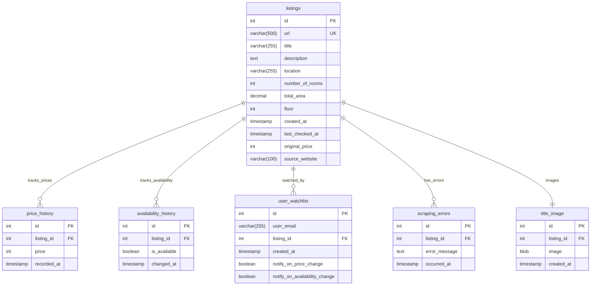

# <ins> Purpose </ins>

The purpose of the repository is to create a python based web-scraper that would parse and store the selected by users rent offering
on periodic base. The idea would be to incorporate different parsers for different rent offering web-sites (like rieltor.ua, dim.ria etc)
and keep track of price changes for selected listings.

## <ins> Host </ins>
Hosting is done on pythonanywhere cloud solution, since the simplicity and rather small amount of data allow us to
use either free of basic account option

## <ins> Approximate database scheme </ins>

